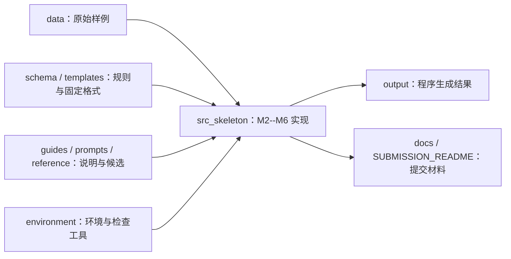

# 数据链暑期学校项目目录说明

项目根目录：`D:\data-link-10245101540-ting-xibei\summer_school_practice_v1.0`

这是一套从 M1 到 M6 的教学数据链处理工程。主线是：读取 OpenSky 离线状态数据 → 编码为 TeachingLink 41 字节帧 → 接收解码与校验 → 多时刻航迹/当前态势 → 双来源统一语义映射 → 质量告警 → 一键集成运行。



## 1. 根目录

```text
summer_school_practice_v1.0/
├─ .venv/
├─ environment/
├─ student_package/
└─ SUBMISSION_README.md
```

| 位置 | 内容与作用 |
|---|---|
| `.venv/` | 本机创建的 Python 虚拟环境，安装实验依赖。它是运行环境，不是实验源代码或应手工修改的成果。 |
| `environment/` | 搭建环境、运行冒烟测试和提交检查的辅助脚本。 |
| `student_package/` | 课程实验的主体：输入数据、规范、模板、实现代码、输出和文档都在这里。 |
| `SUBMISSION_README.md` | M6 综合运行说明，记录环境、入口、输入输出、统计数据、限制和提交信息。 |

## 2. `environment/`：环境和自检工具

```text
environment/
├─ README_environment.md
├─ requirements.txt
├─ setup.ps1 / setup.sh
├─ environment_check.py
├─ run_smoke_test.py
├─ run_student_checks.py
├─ check_student_submission.py
└─ build_wheelhouse.py
```

- `README_environment.md`、`requirements.txt`：说明 Python 版本和依赖。
- `setup.ps1`、`setup.sh`：Windows / Shell 环境初始化。
- `environment_check.py`、`run_smoke_test.py`：检查解释器、依赖和基本运行条件。
- `run_student_checks.py`、`check_student_submission.py`：辅助检查课程要求和提交材料。
- `build_wheelhouse.py`：离线或受限网络下准备依赖包的工具。

## 3. `student_package/`：实验主体

```text
student_package/
├─ data/           # 课程输入样例，原则上只读
├─ docs/           # M1、M5、M6 等提交说明/展示材料
├─ guides/         # 实验说明和引导问题
├─ output/         # M2--M5 运行生成的结果
├─ prompts/        # M4 候选映射提示模板
├─ reference/      # 课程预生成候选映射
├─ schema/         # 协议、字段、统一模型和数据库规范
├─ src_skeleton/   # 本人完成的 M2--M6 Python 实现
├─ templates/      # 输出文件表头和文档格式模板
└─ README.md       # 课程包说明
```

### 3.1 `data/`：原始输入数据

```text
data/
├─ raw_states.json
├─ partner_messages_sample.bin
├─ partner_messages_multitime.bin
├─ m4/
├─ m5/
└─ opensky_real/
```

| 内容 | 用途 |
|---|---|
| `raw_states.json` | M2 的 OpenSky 风格原始状态数组；发送方从这里解析目标、时间、位置、运动等字段。 |
| `partner_messages_sample.bin` | 单帧/少量 TeachingLink 教学消息样例。 |
| `partner_messages_multitime.bin` | M3 必做输入；共 369 字节，即 9 个 41 字节帧，用于生成航迹和当前态势。 |
| `m4/` | M4 的另一来源当前态势样例，例如 TeachingLink 当前态势 CSV。 |
| `m5/` | M5 的异常样例和固定质量规则。 |
| `opensky_real/` | 真实快照扩展验证数据；属于选做验证，不替代固定教学样例。 |

这些数据是课程输入，实验实现不应直接修改它们。

### 3.2 `schema/`：数据和协议的“权威定义”

```text
schema/
├─ opensky_field_dictionary.csv
├─ partner_field_dictionary.csv
├─ teaching_message_spec.md
├─ source_field_definitions.md
├─ unified_model.json
└─ optional_db_schema.sql
```

- `opensky_field_dictionary.csv`：原始状态数组的字段索引、类型和含义。
- `partner_field_dictionary.csv`：TeachingLink 接收记录的字段定义。
- `teaching_message_spec.md`：M2 最重要的协议规范，定义 41 字节、大端字节序、偏移、比例因子、偏置、状态位、有效位和 checksum。
- `source_field_definitions.md`：M4 两类来源字段的业务语义。
- `unified_model.json`：M4 输出统一消息的嵌套结构与字段要求。
- `optional_db_schema.sql`：M3 SQLite 选做持久化的建表参考。

### 3.3 `templates/`：固定输出格式，不是运行结果

此目录保存课程提供的空白 CSV 表头和 Markdown 模板，例如：

- M1：`m1_system_template.md`；
- M2：`decoded_partner_states.csv`、`validation_log.csv`、`roundtrip_report.csv`；
- M3：`track_table.csv`、`current_situation.csv`；
- M4：`llm_mapping_candidate.csv`、`mapping_table.csv`、`m4_review_note.md`；
- M5：`alert_log.csv`、`quality_situation.csv`、`m5_result_note.md`；
- M6：`m6_README_template.md`、`m6_presentation_outline.md`、`submission_checklist.md`。

实现代码读取这些模板的列定义或格式要求，再把真正结果写到 `output/` 或 `docs/`；模板本身不应被改成结果文件。

### 3.4 `guides/`、`prompts/`、`reference/`：说明、提示和候选

| 目录 | 主要内容 | 用途 |
|---|---|---|
| `guides/` | OpenSky 接口摘要、M1 引导问题、提交说明 | 帮助理解任务与验收标准。 |
| `prompts/` | `m4_mapping_prompt_template.md` | 生成/分析 M4 映射候选时的提示模板。 |
| `reference/` | `pre_generated_mapping_candidate.csv` | 课程预生成的 M4 候选映射；只能作为候选，不能未经人工核验直接作为最终规则。 |

### 3.5 `src_skeleton/`：本人完成的程序实现

```text
src_skeleton/
├─ m2_protocol.py
├─ m3_tracks.py
├─ m4_mapping.py
├─ m5_quality.py
└─ run_all.py
```

| 文件 | 负责的模块 | 核心功能 |
|---|---|---|
| `m2_protocol.py` | M2 协议编解码 | 解析 OpenSky 状态数组；按固定偏移编码 41 字节 TeachingLink 帧；验证、解码和量化误差检查。 |
| `m3_tracks.py` | M3 航迹与态势 | 解码 9 帧多时刻消息；按 `target_id` 和 `timestamp` 生成航迹、当前态势、SQLite、查询结果和航迹图。 |
| `m4_mapping.py` | M4 语义互操作 | 核验候选映射；把 OpenSky 和 TeachingLink 两种来源映射到统一 NDJSON 模型。 |
| `m5_quality.py` | M5 一致性保障 | 按固定规则检查位置缺失、延迟、重复、航向越界，输出告警与质量态势。 |
| `run_all.py` | M6 集成入口 | 清理可生成输出后，按 M2 → M3 → M4 → M5 顺序运行并重新读取关键成果做一致性检查。 |

这五个 Python 文件是主要实现代码。M1 是设计说明，不需要单独的 M1 Python 模块。

### 3.6 `output/`：程序生成的数据成果

```text
output/
├─ encoded_messages.bin
├─ decoded_partner_states.csv
├─ validation_log.csv
├─ roundtrip_report.csv
├─ decoded_multitime.csv
├─ track_table.csv
├─ current_situation.csv
├─ states.db
├─ sqlite_query_result.csv
├─ m3_trajectory.png
├─ llm_mapping_candidate.csv
├─ verified_mapping_table.csv
├─ unified_situation.ndjson
├─ m4_ai_mapping_review.md
├─ alert_log.csv
└─ quality_situation.csv
```

| 模块 | 生成结果 | 说明 |
|---|---|---|
| M2 | `encoded_messages.bin` | 连续二进制帧，当前为 3 个 41 字节帧。 |
| M2 | `decoded_partner_states.csv` | 接收端解码后的结构化记录。 |
| M2 | `validation_log.csv` | 字段错误和构造错误帧的校验结果。 |
| M2 | `roundtrip_report.csv` | 编码前后物理量的量化误差报告。 |
| M3 | `decoded_multitime.csv` | 9 帧多时刻消息逐帧解码记录。 |
| M3 | `track_table.csv` | 按目标和时间排序的完整航迹点。 |
| M3 | `current_situation.csv` | 每个目标最新可接受记录。 |
| M3 | `states.db`、`sqlite_query_result.csv` | SQLite 选做持久化及查询证据。 |
| M3 | `m3_trajectory.png` | 根据有效经纬度绘制的航迹图。 |
| M4 | `llm_mapping_candidate.csv` | 未修改保留的候选映射。 |
| M4 | `verified_mapping_table.csv` | 人工核验后的正式映射规则。 |
| M4 | `unified_situation.ndjson` | 两类来源统一后的 6 条态势消息。 |
| M4 | `m4_ai_mapping_review.md` | 候选问题、修订依据、验证结果与局限。 |
| M5 | `alert_log.csv` | 逐条告警事件。 |
| M5 | `quality_situation.csv` | 每条输入记录的 ERROR/WARNING/NORMAL 质量状态。 |

`output/README.md` 只说明输出目录规则；其余文件是程序可重新生成的运行结果。运行 M6 时会清理可生成输出并重建，所以不要手工把它当作长期编辑文档。

### 3.7 `docs/`：实验文档与展示材料

```text
docs/
├─ M1_system_flow.pdf
├─ M1_interface_risk.pdf
├─ M5_result_note.md
├─ m6_presentation_outline.md
└─ README.md
```

- `M1_system_flow.pdf`：M1 系统处理流程图。
- `M1_interface_risk.pdf`：M1 接口、通信和工程风险说明。
- `M5_result_note.md`：M5 异常类型统计、边界处理、正常样例与限制说明。
- `m6_presentation_outline.md`：五页展示的文字提纲；正式答辩时可据此制作 PPT/PDF。
- `docs/README.md`：文档目录说明。

## 4. 最简运行与阅读顺序

第一次理解工程时，推荐按以下顺序阅读：

1. 先读 `guides/opensky_interface_summary.md`、`schema/teaching_message_spec.md`，理解输入与 41 字节协议。
2. 再读 `m2_protocol.py`，理解“原始状态 → 二进制帧 → 接收记录”。
3. 读 `m3_tracks.py` 和 `output/track_table.csv`、`current_situation.csv`，理解多时刻记录如何变成航迹。
4. 读 `m4_mapping.py`、`verified_mapping_table.csv`、`unified_situation.ndjson`，理解跨来源语义如何统一。
5. 读 `m5_quality.py`、`alert_log.csv`、`quality_situation.csv`，理解如何做质量保障。
6. 最后读 `run_all.py` 和根目录 `SUBMISSION_README.md`，理解 M6 如何把前面模块串成一键流程。

在项目根目录运行：

```powershell
.\.venv\Scripts\python.exe -B student_package\src_skeleton\run_all.py
```

该命令会重新生成 `output/` 中的主要结果；输入、规范、模板和实现代码不会被它改写。
